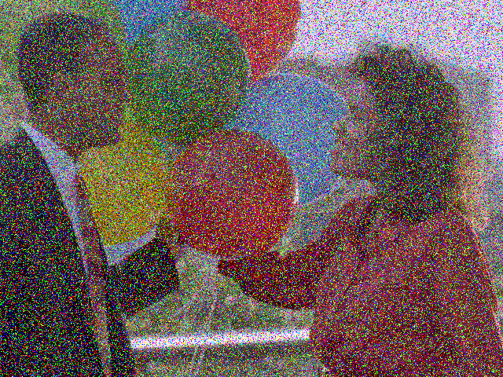

# KNN-based Image Denoising using CUDA

## Overview
This project demonstrates a CUDA-based implementation of KNN image denoising using Google Colab. The main goal is to leverage the parallel processing capabilities of NVIDIA GPUs to enhance the performance of the KNN denoising algorithm on noisy images. The CUDA kernel performs iterative denoising using a fixed window size (3x3), considering both spatial and color distance.

## Project Structure
- **denoise.cu**: The CUDA source file containing the implementation of the KNN-based image denoising algorithm.
- **noisy_image.jpg**: Sample noisy image used as input for denoising.
- **denoised_image.jpg**: The output image generated after denoising.
- **README.md**: Project description and usage instructions.

## Features
- **KNN Denoising**: Implementation of KNN-based denoising algorithm using CUDA.
- **Gaussian Weights**: Uses Gaussian weights for both spatial and range filtering.
- **Iterative Approach**: Repeated application of the denoising kernel for improved results.

## Steps to Run
1. **Setup Google Colab with CUDA**:
   - Make sure GPU runtime is enabled in Google Colab. Go to `Runtime > Change runtime type > Hardware accelerator` and select `GPU`.
   
2. **Clone the Project**:
   - Clone the project repository or copy the `denoise.cu` file and `noisy_image.jpg` into your Google Colab environment.

3. **Install Library**:
   - Install these in the Google Colab environment:
     ```
     !apt-get update
     !apt-get install -y nvidia-cuda-toolkit
     !apt-get install -y libopencv-dev

     ```

4. **Compile and Run the CUDA Code**:
   - Compile the CUDA code using:
     ```
     !nvcc -o denoise denoise.cu `pkg-config --cflags --libs opencv4`
     ```
   - Run the executable:
     ```
     !./denoise
     ```

5. **Download the Output Image**:
   - After execution, download the `denoised_image.jpg` from the environment.

## Parameters
- **K (int)**: Number of nearest neighbors to consider. Default is 6.
- **sigmaS (float)**: Standard deviation for spatial Gaussian filter. Default is 5.0.
- **sigmaR (float)**: Standard deviation for range Gaussian filter. Default is 15.0.
- **iterations (int)**: Number of iterations for the denoising process. Default is 10.

## Key Files
1. **denoise.cu**:
   - Contains the CUDA kernel function `knnDenoiseKernel` for image denoising using KNN.
   - Implements the Gaussian-weighted averaging of the K nearest neighbors.
   - Applies iterative denoising to enhance the image quality.

2. **noisy_image.jpg**:
   - Input image with noise that needs to be denoised.
   

3. **denoised_image.jpg**:
   - Output image after the denoising process.
   
## Improvements and Refinements
- **Optimized Memory Access**: Efficient usage of CUDA memory and parallel computation.
- **Partial Sorting**: Instead of full sorting, a partial sort is used for selecting K nearest neighbors, enhancing performance.
- **Error Handling**: The code ensures proper CUDA error handling for reliable execution.

## Conclusion
This project showcases the power of GPU acceleration using CUDA for real-time image processing tasks. The iterative KNN denoising approach offers a significant reduction in noise, making it suitable for applications in image enhancement and preprocessing.

## Requirements
- Google Colab with GPU enabled
- NVIDIA GPU with CUDA support
- OpenCV for image processing

## References
- [OpenCV Documentation](https://docs.opencv.org/)
- [CUDA Programming Guide](https://docs.nvidia.com/cuda/)

## Conclusion
This project was developed as part of an exercise in implementing and optimizing image processing algorithms using CUDA.

